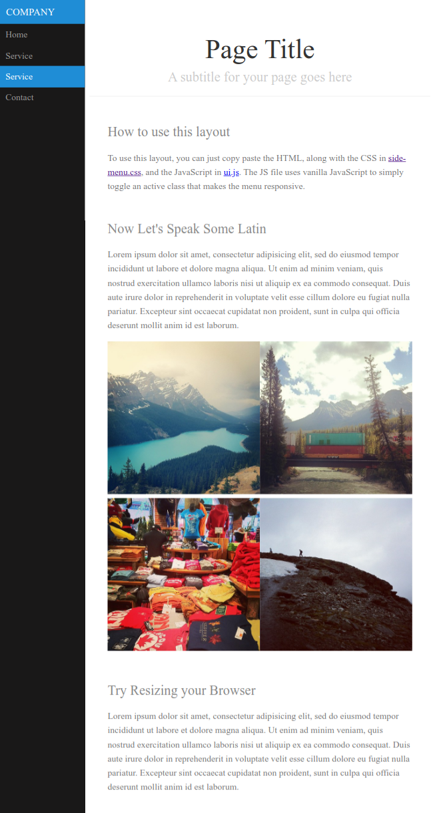

# 7days-layout-challenges

I challenge myself with seven days of layout challenges. Implement them with HTML, CSS, and JS only. No library, no framework.

## Table of Contents

- [7days-layout-challenges](#7days-layout-challenges)
  - [Table of Contents](#table-of-contents)
  - [Day 1 - Login form](#day-1---login-form)
  - [Day 2 - Registration form](#day-2---registration-form)
  - [Day 3 - Sample blog](#day-3---sample-blog)
  - [Day 4 - Photo Gallery](#day-4---photo-gallery)
  - [Day 5 - Side Menu](#day-5---side-menu)
  - [Day 6 - Landing Page](#day-6---landing-page)

## [Day 1 - Login form](./day1-login-form/index.html)

Reference:

- [Template](https://speckyboy.com/creative-login-registration)
- [Make CSS Gradient](https://cssgradient.io/)

[&uarr; Back to top](#table-of-contents)

## [Day 2 - Registration form](./day2-registration-form/index.html)

Reference:

- [Template](./day2-registration-form/template.png)
- [Make CSS Gradient](https://cssgradient.io/)

[&uarr; Back to top](#table-of-contents)

## [Day 3 - Sample blog](./day3-purecss.io-sample-blog/index.html)

Reference:

- [Template](https://purecss.io/layouts/blog/)

[&uarr; Back to top](#table-of-contents)

## [Day 4 - Photo Gallery](./day4-purecss.io-photo-gallery/index.html)

Reference:

- [Template](https://purecss.io/layouts/gallery/)

[&uarr; Back to top](#table-of-contents)

## [Day 5 - Side Menu](./day5-purecss.io-side-menu/index.html)

Reference:

- [Template](https://purecss.io/layouts/side-menu/)

[&uarr; Back to top](#table-of-contents)

## [Day 6 - Landing Page](./day6-purecss.io-landing-page/index.html)

Reference:

- [Template](https://purecss.io/layouts/marketing/)

[&uarr; Back to top](#table-of-contents)
